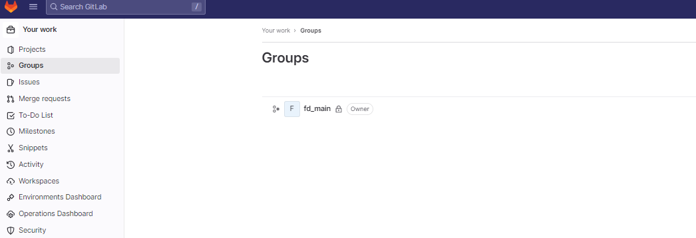

# OIDC Authentication for Airflow Local Example Setup

1. Clone repo down to local machine, docker is required locally to run the containers/ launch the docker compose services.
2. Rename .example.env to .env, and fill in appropriate details.
3. Rename client_secret.example to client_secret.json, replace CLIENT_ID and CLIENT_SECRET with appropriate values from Gitlab IDP Application setup.
3. Build the image from the included Dockerfile, tagging it "airflow-oidc" -
```
docker build -t airflow-oidc .
```
4. Follow steps from included documentation in order to generate Client ID and Secret for a Gitlab application we will use as the auth provider, which is what is being referred to in step 2.
5. After image has finished building, you can launch the entire stack with:
```
docker-compose -f airflow-etl.yaml up
```
6. Browse to http://localhost:8060, and if setup is done correctly, you will be redirected to a Gitlab login page.  Login here, and you will be redirected to the local airflow instance.
7. Your first time logging in you will likely have a screen that says "Your user has no roles and/or permissions!", this is because the user did not previously exist in the included DB, and we need to assign them proper permissions.
8. Connect to the service labeled "openid-app-airflow-webserver-*" by entering 
```
docker ps
```
In the terminal, then copying the instance id of the container matching the label above.
Now we can enter a console on that container with:
```
docker exec -it <CONTAINER_ID> bash
```
Then we can view the list of airflow users, which will show the user that was just created after logging in with Gitlab:
```
airflow users list
```
You will see an output similar to this:
```
docker exec -it 8a47b651a82a bash
airflow@8a47b651a82a:/opt/airflow$ airflow users list
id | username     | email                    | first_name | last_name | roles
===+==============+==========================+============+===========+=============
1  | airflow      | airflowadmin@example.com | Airflow    | Admin     | Admin
2  | mark.degroat | mark.degroat@rearc.io    | Mark       | deGroat   | Admin,Public
```

Take note of the username, and in that same bash console for the container, assign permissions to that new user:
```
airflow users add-role -u <USERNAME> -r Admin
```
Which when combined with the value from the table above, becomes:
```
airflow users add-role -u mark.degroat -r Admin
```
9. Refresh the page, and you should now see the Airflow dashboard, logged in as the user shown above with Admin permissions.

Next is a detailed breakdown of this repository and the setup:


# OIDC Authentication for Airflow

# **OIDC Authentication for Airflow 2.x by Extending Flask App Builder Auth Functionality**

### **Goal:** Allow end users to authenticate to Airflow 2.x Webserver using OIDC (OpenID Connect), where they login to a 3rd party IDP (identity provider), and then are authenticated and redirected back to the Airflow instance.

### Allow the ability to make groups of users in the 3rd party IDP that are explicitly allowed to access Airflow, and if that user does not have this group assigned, they are not authorized.

**Intro**: Airflow is a product that was built on top of FAB, or Flask App Builder, which is going to allow us to extend the authentication capabilities of that underlying framework in order to enable OIDC for our Airflow users.  By changing some configuration settings for Airflow itself, and then adding in some additional logic for when FAB performs login and logout actions, we can enable a flow where on login users are redirected to our 3rd party IDP to be authenticated.  If successfully authenticated, they will be redirected back to our airflow instance where they are authenticated and permissioned accordingly.

**Resources Overview:**  With this document you are also receiving [an example repository](https://github.com/rearc/airflow-gitlab-oidc-demo) where we are using docker and docker compose to bootstrap an example Airflow instance, and also modifying this instance with a custom webserver_config.py file, with a corresponding config_secrets.json file that holds our token, secret and some other IDP and airflow instance specific details.
This repo was setup using Gitlab as the intended 3rd party IDP, and we will highlight where this will need to be modified depending on the IDP you will be utilizing for this task. 

We will be referring to your current Airflow setup using [this repo](https://github.com/aws/aws-mwaa-local-runner/tree/v2.5.1) - this is a representation of a managed Airflow instance on AWS, but locally recreated in order to facilitate testing before going to production.  

Please note your setup might differ drastically from this directory layout, but the important piece really lies in the webserver_config.py file, which is usually created by default for Airflow, where you may already have some existing configuration changes/ customizations for your current Airflow setup.  As long as you can modify environment variables, and make changes to this file necessary to allow the OIDC flow, you should be good to proceed. 

In the included repo, you will see 6 files.

**.example.env -** this is an example env file that shows what values will need be to set in the airflow environment in order for this to function correctly

**.gitignore -** git specific ignore file for not committing client_secret.json or any real .env files

**client_secret.example (used to manually create client_secret.json) -** Because we need to manually register our client with the OpenID provider, we need to craft this file in this format in order to correctly pass needed tokens to the Flask-OIDC library and it’s functions we will be utilizing. [More info here.](https://flask-oidc.readthedocs.io/en/latest/#manual-client-registration)

**webserver_config.py** - This is a base webserver_config.py file that is generated by airflow, but has been extended to allow us to use our 3rd party OpenID Provider to authenticate logins, and to revoke tokens on logout.  In here we also extend the OIDCSecurityManager class to apply these new configuration values. (TODO REWORD)

 **airflow-etl.yml -** this is a docker compose file that defines the services needed in order to emulate a full airflow instance.  It also correctly mounts the client_secret.json file to the same root directory as webserver_config.py.

**Dockerfile -** This dockerfile uses the base airflow 2.1.4 image from apache, and installs python3 libraries that will be utilized by the logic added in webserver_config.py above.  It also loads the webserver_config.py file into the airflow directory of the example airflow instance, at the same location the config_secrets.json file is loaded.

**************Configuration / ENV Variables**************

Airflow allows you to update configuration in a number of different ways, [detailed here](https://airflow.apache.org/docs/apache-airflow/stable/configurations-ref.html#) for Airflow 2.x.  

1. You can directly modify the auto generated airflow.cfg file, changes and adding values as you see fit.
2. You can place a webserver_config.py file (as we are doing in this example) in the {AIRFLOW_HOME} directory to override settings for the [webserver] section of the config
3.  [You can create ENV variables following the format](https://airflow.apache.org/docs/apache-airflow/stable/administration-and-deployment/production-deployment.html#configuration) AIRFLOW__{SECTION_NAME}__{KEY_NAME}  

Please note the double underscores. The first example below, AIRFLOW__API__AUTH_BACKEND, modifies the [api] section of configuration, and sets the auth_backend config setting to the module ‘airflow.api.auth.backend.basic_auth’.  Another example could be AIRFLOW__WEBSERVER__AUTHENTICATE in order to access the config settings “authenticate” for the [webserver] section of the configuration.

There is an order of precedence for these changes, such that if you have changes at both the ENV var level and the airflow.cfg file level that overlap, [the precedence is](https://airflow.apache.org/docs/apache-airflow/stable/howto/set-config.html):

1. set as an environment variable (`AIRFLOW__DATABASE__SQL_ALCHEMY_CONN`)
2. set as a command environment variable (`AIRFLOW__DATABASE__SQL_ALCHEMY_CONN_CMD`)
3. set as a secret environment variable (`AIRFLOW__DATABASE__SQL_ALCHEMY_CONN_SECRET`)
4. set in `airflow.cfg`
5. command in `airflow.cfg`
6. secret key in `airflow.cfg`
7. Airflow’s built in defaults

************Our Changes to ENV Vars:************

```jsx
AIRFLOW__API__AUTH_BACKEND='airflow.api.auth.backend.basic_auth'
ALLOWED_PROVIDER_GROUPS='fd_main,another_group'
NICKNAME_OIDC_FIELD='nickname'
FULL_NAME_OIDC_FIELD='name'
GROUPS_OIDC_FIELD='groups'
EMAIL_FIELD='email'
SUB_FIELD='sub'
OIDC_CLIENT_SECRETS='client_secret.json'
```

Please note the first ENV var change is just for this example, and is to set the auth back of the airflow api to basic auth.  This is not the same as the auth method for the webserver, which we are modifying in this example to OIDC.

The next one, ALLOWED_PROVIDER_GROUPS, is if you want to only allow certain “groups” from your OIDC provider to login.  If not, you can exclude this env var.

The next set, NICKNAME_OIDC_FIELD through SUB_FIELD, are the fields that OIDC protocol will need mapped that may be specific to your 3rd party OIDC provider.  These are the values needed for Gitlab, but yours may differ.  [More info is available here.](https://openid.net/specs/openid-connect-core-1_0.html#StandardClaims)

OIDC_CLIENT_SECRETS is where our client_secret.json is located, and what it is named.

****************************************************webserver_config.py Changes and Overview****************************************************

This file is where we are going to modify some constants that Airflow uses in order to configure itself,  extend the AuthOIDView from FAB to check auth and if the user belongs to the correct group on login, and revoking token on logout - then also defining a custom OIDCSecurityManager class where we configure airflow to use OpenIDConnect, and use our new extended version of AuthOIDView in place of the legacy one.

```python
import os, logging, json, posixpath

from airflow import configuration as conf
from airflow.www.security import AirflowSecurityManager
from flask import abort, make_response, redirect
from flask_appbuilder.security.manager import AUTH_OID
from flask_appbuilder.security.views import AuthOIDView
from flask_appbuilder.views import ModelView, SimpleFormView, expose
from flask_login import login_user
from flask_oidc import OpenIDConnect

logger = logging.getLogger(__name__)
```

First we need to bring in some libraries we are going to be using ,and then setup logging.

Next we are going to set the OIDC fields that we are going to be mapping from our 3rd party IDP.

Keep in mind these are currently configured as ENV variables, but we can modify the default values below if we want to instead just have these hardcoded for our instance, then leave the ENV vars blank. 

```python
# Set the OIDC field that should be used
NICKNAME_OIDC_FIELD = os.getenv('NICKNAME_OIDC_FIELD', 'nickname')
FULL_NAME_OIDC_FIELD = os.getenv('FULL_NAME_OIDC_FIELD', 'name')
GROUPS_OIDC_FIELD = os.getenv('GROUPS_OIDC_FIELD', 'groups')
EMAIL_FIELD = os.getenv('EMAIL_FIELD', 'email')
SUB_FIELD = os.getenv('SUB_FIELD', 'sub')  # User ID
```

Next, if we are going to utilize groups from our IDP, this next piece handles pulling our comma separated values from the ALLOWED_PROVIDER_GROUPS env var and places them into an array of strings that will be referenced later on in the code.  If you don’t want to utilize groups, this code can stay as is and the array will be initialized as empty.

```python
# Convert groups from comma separated string to list
ALLOWED_PROVIDER_GROUPS = os.environ.get('ALLOWED_PROVIDER_GROUPS')
if ALLOWED_PROVIDER_GROUPS:
    ALLOWED_PROVIDER_GROUPS = [g.strip() for g in ALLOWED_PROVIDER_GROUPS.split(',')]
else: ALLOWED_PROVIDER_GROUPS = []

if ALLOWED_PROVIDER_GROUPS:
    logger.debug('AirFlow access requires membership to one of the following groups: %s'
        % ', '.join(ALLOWED_PROVIDER_GROUPS))
```

After, we are now going to create a new view class, AuthOIDCView, that will extend AuthOIDView - we pass AuthOIDView as the param to our new class:

```python
# Extending AuthOIDView
class AuthOIDCView(AuthOIDView):
```

Then, we are going to extend the existing handle_login() function - let’s strip out the extraneous logic and just look at the core:

```python
		@expose('/login/', methods=['GET', 'POST'])
    def login(self, flag=True):

    sm = self.appbuilder.sm
    oidc = sm.oid
				@self.appbuilder.sm.oid.require_login
				def handle_login():
            user = sm.auth_user_oid(oidc.user_getfield(EMAIL_FIELD))
            login_user(user, remember=False)
            return redirect(self.appbuilder.get_url_for_index)

        return handle_login()
```

We overload the login function, and expose it for route “/login” and methods GET or POST.

We then alias the security manager, by referencing self.appbuilder.sm, then also pull oidc from that new sm object.
We are calling auth_user_oid from security manager, and passing the email of the user attempting to login in order to lookup the user (if they exist).  If they do, we will call login_user, then redirect them to the index of the FAB, which should be the index of the airflow application.

But in order to allow our group check to occur, we are going to add in a check if the ALLOWED_PROVIDER_GROUPS constant is defined:

```python
		# Group membership required
    if ALLOWED_PROVIDER_GROUPS:

        # Fetch group membership information from OIDC provider
        groups = oidc.user_getinfo([GROUPS_OIDC_FIELD]).get(GROUPS_OIDC_FIELD, [])
        intersection = set(ALLOWED_PROVIDER_GROUPS) & set(groups)
        logger.debug('AirFlow user member of groups in ACL list: %s' % ', '.join(intersection))

        # Unable to find common groups, prevent login
        if not intersection:
            return abort(403)
```

Using the array of allowed groups set above, we reference the key of the GROUPS_OIDC_FIELD we set in the ENV vars, and then make sure this value back from the IDP is one of the values we have defined in our array of groups.  If not, we will throw a 403 unauthorized.  We could extend this to also have a more detailed message for the end user, saying something like “Please check with your Airflow administrator, it appears you do not belong to the correct permissions group for accessing Airflow.”

After this block, we also have the logic in place for creating a new user in Airflow if they did not previously exist in the system, using the details passed to us from the external IDP.  You may want to just delete this block if it’s not needed for your implementation, or return the appropriate HTTP error code and message to end users.

```python
# Create user (if it doesn't already exist)
  if user is None:
      info = oidc.user_getinfo([
          NICKNAME_OIDC_FIELD,
          FULL_NAME_OIDC_FIELD,
          GROUPS_OIDC_FIELD,
          SUB_FIELD,
          EMAIL_FIELD,
          "profile"
      ])
      full_name = info.get(FULL_NAME_OIDC_FIELD)
      if " " in full_name:
          full_name = full_name.split(" ")
          first_name = full_name[0]
          last_name = full_name[1]
      else:
          first_name = full_name
          last_name = ""
      user = sm.add_user(
          username=info.get(NICKNAME_OIDC_FIELD),
          first_name=first_name,
          last_name=last_name,
          email=info.get(EMAIL_FIELD),
          role=sm.find_role(sm.auth_user_registration_role)
      )
```

Putting all these together our handle_login function becomes:

```python
@expose('/login/', methods=['GET', 'POST'])
def login(self, flag=True):

    sm = self.appbuilder.sm
    oidc = sm.oid

    @self.appbuilder.sm.oid.require_login
    def handle_login():
        user = sm.auth_user_oid(oidc.user_getfield(EMAIL_FIELD))

        # Group membership required
        if ALLOWED_PROVIDER_GROUPS:

            # Fetch group membership information from OIDC provider
            groups = oidc.user_getinfo([GROUPS_OIDC_FIELD]).get(GROUPS_OIDC_FIELD, [])
            intersection = set(ALLOWED_PROVIDER_GROUPS) & set(groups)
            logger.debug('AirFlow user member of groups in ACL list: %s' % ', '.join(intersection))

            # Unable to find common groups, prevent login
            if not intersection:
                return abort(403)

        # Create user (if it doesn't already exist)
        # TODO: remove for client as we do not want to allow new users to be created, just map from current IDP to existing airflow user
        if user is None:
            info = oidc.user_getinfo([
                NICKNAME_OIDC_FIELD,
                FULL_NAME_OIDC_FIELD,
                GROUPS_OIDC_FIELD,
                SUB_FIELD,
                EMAIL_FIELD,
                "profile"
            ])
            full_name = info.get(FULL_NAME_OIDC_FIELD)
            if " " in full_name:
                full_name = full_name.split(" ")
                first_name = full_name[0]
                last_name = full_name[1]
            else:
                first_name = full_name
                last_name = ""
            user = sm.add_user(
                username=info.get(NICKNAME_OIDC_FIELD),
                first_name=first_name,
                last_name=last_name,
                email=info.get(EMAIL_FIELD),
                role=sm.find_role(sm.auth_user_registration_role)
            )

        login_user(user, remember=False)
        return redirect(self.appbuilder.get_url_for_index)

    return handle_login()
```

Below that is our logout override/ extension :

```python
		@expose('/logout/', methods=['GET', 'POST'])
    def logout(self):
        oidc = self.appbuilder.sm.oid
        if not oidc.credentials_store:
            return redirect('/login/')
        self.revoke_token()
        oidc.logout()
        super(AuthOIDCView, self).logout()
        response = make_response("You have been signed out")
        return response
```

Same idea as before, we are extending logout to have a bit of additional logic, we first see if the oidc object has credentials stored (check if they are even authorized to begin with), then we throw them to the login page if they’re not.  Next we use a function that is defined directly below this one, self.revoke_token - we will go over this more  below.  Then we call the logout function from the built in security manager, then we call the super of the extended class in order to follow the legacy logout flow that was in place before.

Next we have the revoke_token function:

```python
def revoke_token(self):
        """ Revokes the provided access token. Sends a POST request to the token revocation endpoint
        """
        import aiohttp
        import asyncio
        import json
        oidc = self.appbuilder.sm.oid
        sub = oidc.user_getfield(SUB_FIELD)
        config = oidc.credentials_store
        config = config.get(str(sub))
        config = json.loads(config)
        payload = {
            "token": config['access_token'],
            "token_type_hint": "refresh_token"
        }
        auth = aiohttp.BasicAuth(config['client_id'], config['client_secret'])
        # Sends an asynchronous POST request to revoke the token
      
        async def revoke():
            async with aiohttp.ClientSession() as session:
                async with session.post(self.appbuilder.app.config.get('OIDC_LOGOUT_URI'), data=payload, auth=auth) as response:
                    logging.info(f"Revoke response {response.status}")

        loop = asyncio.new_event_loop()
        asyncio.set_event_loop(loop)
        loop.run_until_complete(revoke())
```

Because the idea of a token is not present in the legacy flow we are changing, we are not going to be overloading a previous function here.

Depending on the IDP we are using, this may change a bit, but the basic idea is we need to grab the details from the currently logged in user, build an auth package, then hit the “revoke” endpoint of our IDP asynchronously in order to expire or revoke the token of the logged in user.  This will be used in tandem with logout in order to make sure they are no longer authorized to access.  The only reason it is done asynchronously is there is no reason the user should have to wait to logout, we can simply assume we will correctly revoke their token and let that process happen without stalling the end user.

Next we need to create a custom Security Manager class:

```python
class OIDCSecurityManager(AirflowSecurityManager):
    """
    Custom security manager class that allows using the OpenID Connection authentication method.
    """
    def __init__(self, appbuilder):
        super(OIDCSecurityManager, self).__init__(appbuilder)
        if self.auth_type == AUTH_OID:
           self.oid = OpenIDConnect(self.appbuilder.get_app)
           self.authoidview = AuthOIDCView
```

In here we are extending the existing AirflowSecurityManager and changing a few of the object level params that control the OID method, and specify which view will be used for authoidview - we are assigning the view we created above (AuthOIDCView) in order to trigger this logic we have created.

Next, we are going to take advantage of a configuration option described in [Airflow’s documentation here](https://airflow.apache.org/docs/apache-airflow/stable/howto/set-config.html#configuring-flask-application-for-airflow-webserver), where instead of changing these options in airflow.cfg file, we are instead using webserver_config.py in order to update these values :

```python
basedir = os.path.abspath(os.path.dirname(__file__))

SECURITY_MANAGER_CLASS = OIDCSecurityManager
# The SQLAlchemy connection string.
SQLALCHEMY_DATABASE_URI = conf.get('core', 'SQL_ALCHEMY_CONN')

# Flask-WTF flag for CSRF
CSRF_ENABLED = True

AUTH_TYPE = AUTH_OID
OIDC_CLIENT_SECRETS = os.getenv('OIDC_CLIENT_SECRETS', 'client_secret.json')  # Configuration file for OIDC provider OIDC
OIDC_COOKIE_SECURE= False
OIDC_ID_TOKEN_COOKIE_SECURE = False
OIDC_REQUIRE_VERIFIED_EMAIL = False
OIDC_USER_INFO_ENABLED = True
CUSTOM_SECURITY_MANAGER = OIDCSecurityManager

# Ensure that the secrets file exists
if not os.path.exists(OIDC_CLIENT_SECRETS):
    ValueError('Unable to load OIDC client configuration. %s does not exist.' % OIDC_CLIENT_SECRETS)

# Parse client_secret.json for scopes and logout URL
with open(OIDC_CLIENT_SECRETS) as f:
    OIDC_APPCONFIG = json.loads(f.read())

# Ensure that the logout/revoke URL is specified in the client secrets file
PROVIDER_OIDC_URL = OIDC_APPCONFIG.get('web', {}).get('issuer')
OIDC_PROVIDER_NAME = OIDC_APPCONFIG.get('web', {}).get('name')
if not PROVIDER_OIDC_URL:
    raise ValueError('Invalid OIDC client configuration, OIDC provider OIDC URI not specified.')

# this will change based on the OIDC provider
OIDC_SCOPES = OIDC_APPCONFIG.get('OIDC_SCOPES', ['openid', 'email', 'profile'])  # Scopes that should be requested.
OIDC_LOGOUT_URI = posixpath.join(PROVIDER_OIDC_URL, 'oauth/revoke') # OIDC logout URL

# Allow user self registration
AUTH_USER_REGISTRATION = False

# Default role to provide to new users
AUTH_USER_REGISTRATION_ROLE = os.environ.get('AUTH_USER_REGISTRATION_ROLE', 'Public')

AUTH_ROLE_ADMIN = 'Admin'
AUTH_ROLE_PUBLIC = "Public"

OPENID_PROVIDERS = [
   {'name': OIDC_PROVIDER_NAME, 'url': posixpath.join(PROVIDER_OIDC_URL, 'oauth/authorize')}
]
```

What is important to highlight is - 

********OIDC_CLIENT_SECRETS -******** the path to client_secret.json file we created, which is then referenced by other constants

**CUSTOM_SECURITY_MANAGER -** points to class we just built above that adds OIDC functionality to the base AirflowSecurityManager

**PROVIDER_OIDC_URL** - base URL for the upstream OIDC provider, pulled from client_secret.json .

**OIDC_SCOPES** - [More info here.  Standard claims for OIDC.](https://auth0.com/docs/get-started/apis/scopes/openid-connect-scopes#standard-claims)

[](https://auth0.com/docs/get-started/apis/scopes/openid-connect-scopes#standard-claims)**OPENID_PROVIDERS** - this is an array of objects, each containing the details of the OpenID Provider you want to support.  In here we will need to update these values to be in line with whatever IDP we are connecting to.  The url is what will be hit when initially authorizing, and may differ from IDP to IDP.  Comes from client_secret.json .

**Gitlab IDP Setup (Only required if Gitlab is the chosen 3rd party IDP)**

In gitlab you can make “applications” at the user level, group level or instance level.  We are going to cover creating a group application, then demonstrate how the group name is checked during authentication to ensure that user is not only authenticated through gitlab, but also belongs to the correct group to allow/disallow access to the airflow instance.

First, make sure you have a gitlab account setup, and create a sample project and place it into a sample group.  

****
Our group for this example is named “fd_main” - 



Click the example group, then on the left hand nav menu, select “Settings”, then in the “General” sub menu, click on “Applications” :


Now you will see a form, that has some basic options, then the ability to set scopes for this application.  We want to name the application something we can remember, test_airflow_ouath for the purposes of this demo, and then set the Callback URL to the oidc_callback route that our airflow, which in our case is

```jsx
http://localhost:8060/oidc_callback
```

and then we are going to enable only the scopes:
openid
profile
email.

Ensure “Confidential” is also checked.


Save the application, and then you will be presented with a screen that shows the client_id and client_secret that we will need to put into our client_secret.json file in our repository.


Save these values somewhere safe for the time being until were ready to encode them for the local airflow instance test.